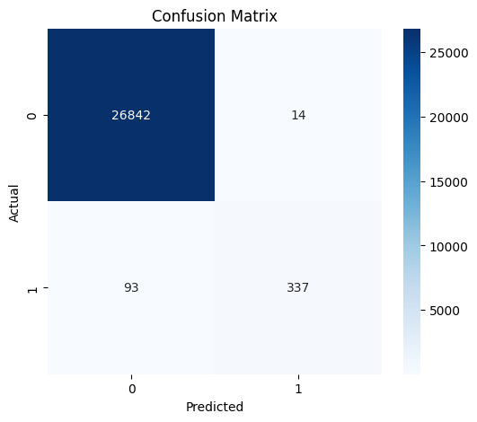
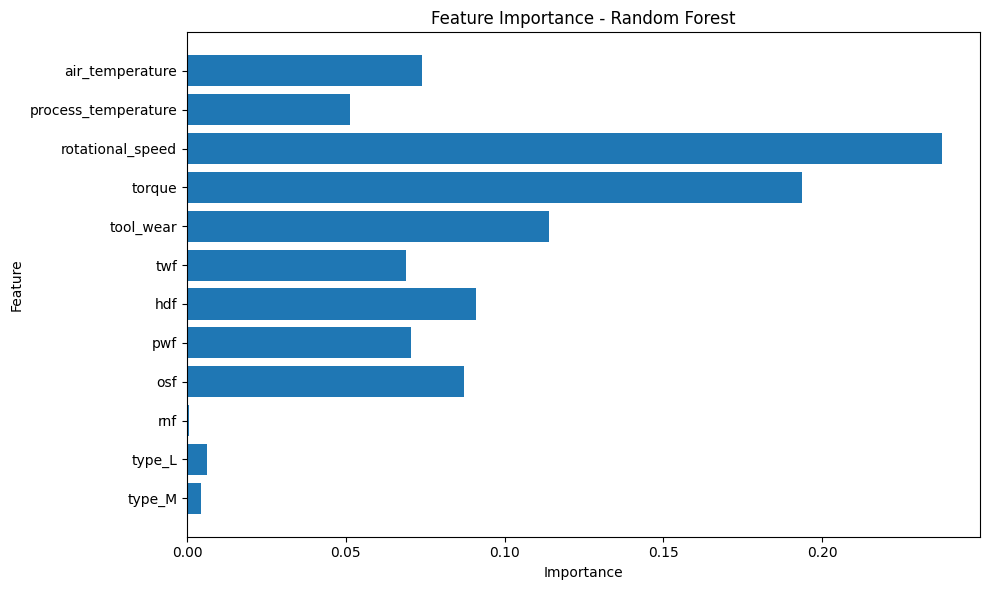

# Predictive Maintenance: Machine Failure Prediction

## Overview

This project uses machine learning to predict machine failures
based on operational and sensor-related data.

The project includes data cleaning, exploratory data analysis,
feature engineering, model training, evaluation and feature
importance analysis.

## Dataset

The dataset is from the Kaggle Playground Series Season 3,
Episode 17: Binary Classification of Machine Failures.

The training dataset contains 136,429 records.

## Technologies Used

- Python
- Pandas
- NumPy
- Matplotlib
- Seaborn
- Scikit-learn
- Jupyter Notebook

## Machine Learning Model

Random Forest Classifier

The model was trained using class balancing because machine
failures represented only 1.57% of the dataset.

## Model Results

| Metric | Score |
|---|---:|
| Accuracy | 99.61% |
| Precision | 96.01% |
| Recall | 78.37% |
| F1-score | 86.30% |
| ROC-AUC | 93.73% |

## Important Features

The most important features identified by the Random Forest model were:

1. Rotational Speed
2. Torque
3. Tool Wear

## Project Workflow

Data Collection  
↓  
Data Cleaning  
↓  
Exploratory Data Analysis  
↓  
Feature Selection  
↓  
Categorical Encoding  
↓  
Train-Test Split  
↓  
Random Forest Model  
↓  
Model Evaluation  
↓  
Feature Importance Analysis

## Key Finding

The exploratory analysis showed that machines in the
200+ tool-wear group had a higher observed failure rate
than the lower tool-wear groups.

## Future Improvements

- Hyperparameter tuning
- Comparison with other machine-learning models
- Time-based validation
- Investigation of possible data leakage
- Model deployment using an API or web application
## Model Evaluation

### Confusion Matrix

### Feature Importance

